<!-- Please do not change this html logo with link -->

# TCP/IP Lite solutions using ENCx24J600

This repository provides MPLAB X IDE projects that can work out of the box. The solutions that are included in the repository include functionality for UDP, TCP Server and TCP Client Demos. Note that the TCP/IP Lite stack needs to be serviced every 1 second and the timer callback function needs to be set to 1 second.

---

## Related Documentation

More details can be found at the following links:
- [Microchip Ethernet Controllers](https://www.microchip.com/design-centers/ethernet/ethernet-devices/products/ethernet-controllers)
- [ENCx24J600](https://www.microchip.com/wwwproducts/en/en541877)
- [Ethernet PICtail Plus Daughter Board](https://www.microchip.com/DevelopmentTools/ProductDetails/PartNO/AC164132)
- [Explorer 8 Development Board](https://www.microchip.com/promo/explorer-8-development-board)

## Software Used

- MPLAB® X IDE v5.40 or later [(microchip.com/mplab/mplab-x-ide)](http://www.microchip.com/mplab/mplab-x-ide)
- MPLAB® XC8 v2.20 or later [(microchip.com/mplab/compilers)](http://www.microchip.com/mplab/compilers)
- TCP/IP Lite Stack v3.0.0
- Ethernet Drivers Library v3.0.0
- TCPIP Demo GUI v2.0
- [Wireshark Tool](https://www.wireshark.org/)

## Hardware Used

- Explorer 8 Development Kit [(DM160228)](https://www.microchip.com/Developmenttools/ProductDetails/DM160228)
- Fast 100Mbps Ethernet PICtail Plus Daughter Board [(AC164132)](https://www.microchip.com/DevelopmentTools/ProductDetails/PartNO/AC164132)
- [PIC18F87K22](https://www.microchip.com/wwwproducts/en/PIC18F87K22)

---

## UDP Solution

1. Open MPLABX IDE.
 
2. From the downloaded projects, open encx24j600-udp-solution.X.
3.	Open Windows Command Prompt application on your PC. Type “ipconfig” to get the IP address of your PC.
 
4.	Sending UDP Packets: In udp_demo.c, under the function DEMO_UDP_Send():
    - Modify the Destination IP address with your PC’s IP address as noted in Step 3.
    - Destination Port (anything in the range of dynamic ports)
     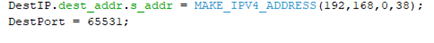
5.	Receiving UDP Packets: In Source Files\MCC generated files\ udpv4_port_handler_table.c, add the following code:
    - In UDP_CallBackTable, add the following code to perform UDP Receive:
     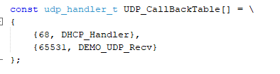
6.	Click on Program Device to program the code to the device.
7. Launch Wireshark. From the Capture menu, click Options.
Select an Interface from the list to which your board and PC are connected, click Start for capturing packets.
 
e.g.: Local Area Network
 
8. Check the IP address of the Explorer 8 Development Board which is displayed on the LCD. Note it down.
9.	Open the Java application TCPIP_Demo.exe. Go to the UDP tab and assign the same port number as ‘DestPort’(65531). Click on ‘Listen’ button. Click “Allow Access” if warning occurs. Assign the IP Address of your board which is displayed on the LCD(192.168.0.46). Click on ‘Claim’ button.
 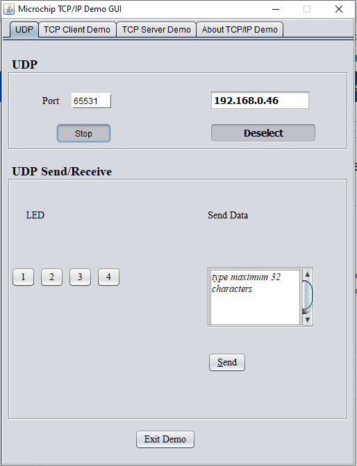
10.	In Wireshark, set the filter field as bootp||udp.port==65531.
11.	In Demo GUI, click on LED 1, 2, 3, 4 to light the LEDs D1, D2, D3, D4, respectively and observe the Wireshark capture. 
 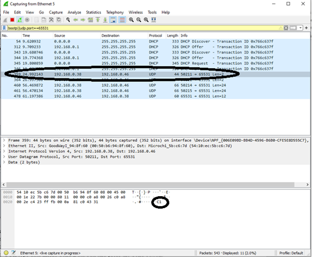
12.	In Demo GUI, type data(e.g.: “Microchip PIC18F87K22”) inside Send Data box and press the Send button and observe the Wireshark capture.
 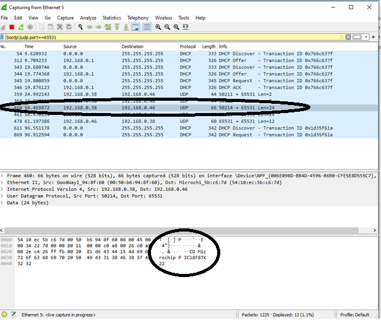
13.	On the Explorer 8 Board, press the Switch S1 and observe the Wireshark capture. 
 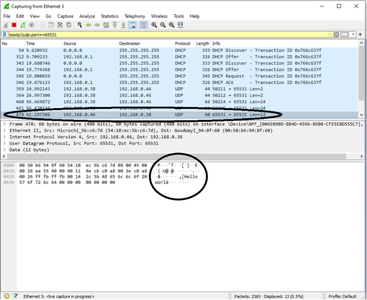

---

## TCP Client Solution

1. Open MPLABX IDE.
 
2. From the downloaded projects, open encx24j600-tcp-client-solution.X.
3. Check the IP address of the Explorer 8 Development Board which is displayed on the LCD. Note it down.
4.	In main.c, add the following code:
    - Modify the server IP address with PC's IP address.
 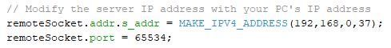
4.	Click on Program Device to program the code to the device.
5.	Open the Java application TCPIP_Demo.exe. Go to the TCP Server Demo tab and assign the port number as ‘65534’. Click on ‘Listen’ button. The status of the TCP Connection is printed inside the STATUS text box.
 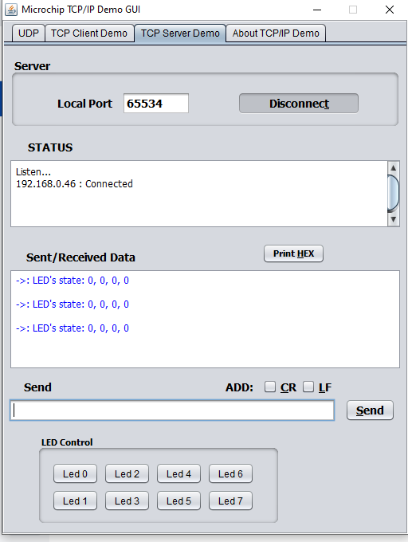
 Also you can observe the same on Wireshark with filter as “bootp||tcp.port==65534”.
 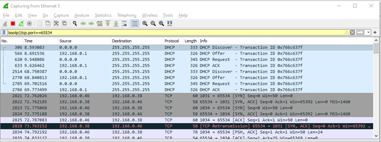
6.	After the connection is established:
    - Type text inside the Send text box and click on ‘Send’ button. The text sent is displayed inside the Sent/Received Data box and in the Wireshark window.
     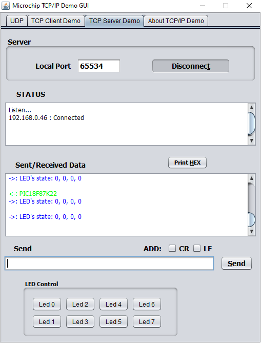
     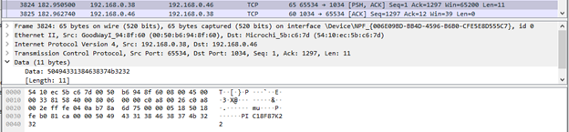
    - Click on the Led buttons {0, 1, 2, 3, 4}. This will toggle LEDs on board.
     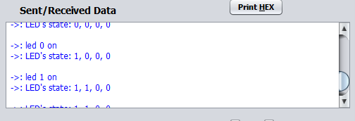
     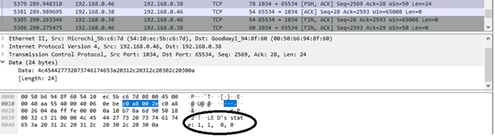
7.	Push ‘Disconnect’ button, to close the TCP Connection. A client disconnected message will appear on the STATUS text box.  

---

## TCP Server Solution

1. Open MPLABX IDE.
 
2. From the downloaded projects, open encx24j600-tcp-server-solution.X.
3.	Click on Program Device to program the code to the device.
4.	Open the Java application TCPIP_Demo.exe. Go to the TCP Client Demo tab, observe the IP address of your board i.e., on the LCD and assign it as Server IP address in the GUI. Assign the port number as ‘7’. Click on ‘Connect’ button. The status of the TCP Connection is printed inside the STATUS text box.
 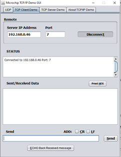
5.	After the connection is established:
    - Type text inside the Send text box and click on ‘Send’ button. The text sent is echoed and displayed inside the Sent/Received Data box.
     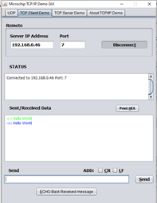
    - Also in Wireshark, you can observe the TCP packets by setting the filter “tcp.port == 7” 
     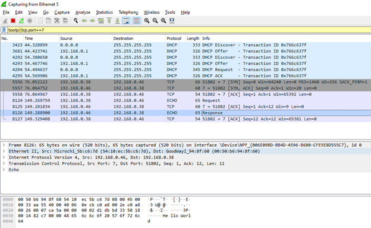
6.	Push ‘Disconnect’ button, to close the TCP Connection. TCP server closing the connection message will appear on the STATUS text box.

---